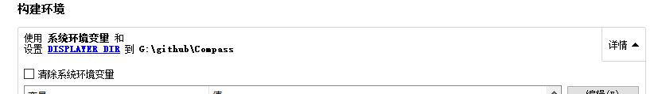

## 以 DLL 方式调用 Displayer3D 的接口

### 1. 设置环境变量

以我的本地路径为例：`DISPLAYER_DIR = G:\github\Compass`



### 2. 在 .pro 文件中引入 libdisplay.pri 

include($$(DISPLAYER_DIR)/libdisplay.pri)

### 3. 使用导出类 Displayer3D

```cpp
MainWindow::MainWindow(QWidget *parent) :
    QMainWindow(parent),
    ui(new Ui::MainWindow),
    displayer(new Displayer3D(this))
{
    setWindowTitle("TestLibDisplayer");
    ui->setupUi(this);
    bool inited = displayer->init();
    if(inited) {
        QWebEngineView *view = displayer->getView();
        qDebug() << "STart" << view;
        if(view!= 0) {
//            ui->centralWidget->layout()->addWidget(view);
            qDebug() << ui->groupBox->layout();
            ui->groupBox->layout()->addWidget(view);
        }
        displayer->show();
    }
}
```